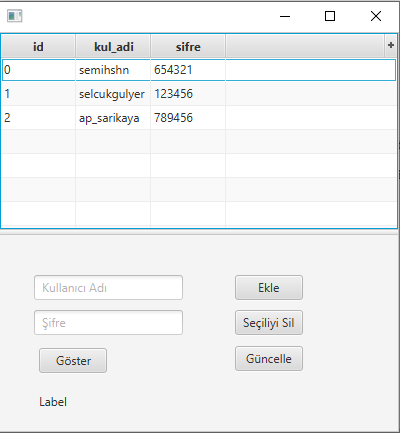

 
 

# JavaFx : 

### JavaFX, Java tabanlı masaüstü, gömülü veya mobil cihazlarda çalışabilen GUI uygulamaları oluşturmak için geliştirilen bir platformdur :blush:

 

# Gereksinimler

<ul>
<li>Eclipse IDE</li>
<li>E(fx)lipse IDE entegrasyonu</li>
<li>JDK 8 ve üzeri sürümler</li>
<li>JavaFX Kütüphaneleri</li>
</ul>

# IDE
"Eclipse IDE for Java Developers" kurmalısınız. 

 

# JDK

 

# E(fx)lipse Entegrasyonu

 

# JavaFX Kütüphaneleri

# Run Configurations/VM Arguments
--module-path "C:\Program Files (x86)\JavaFx\javafx-sdk11.0.2\lib" --add-modules javafx.controls,javafx.fxml

### Path yerine kendi yüklediğiniz yeri yazın :call_me_hand:
 
 

# Derslerden Örnek Resimler

